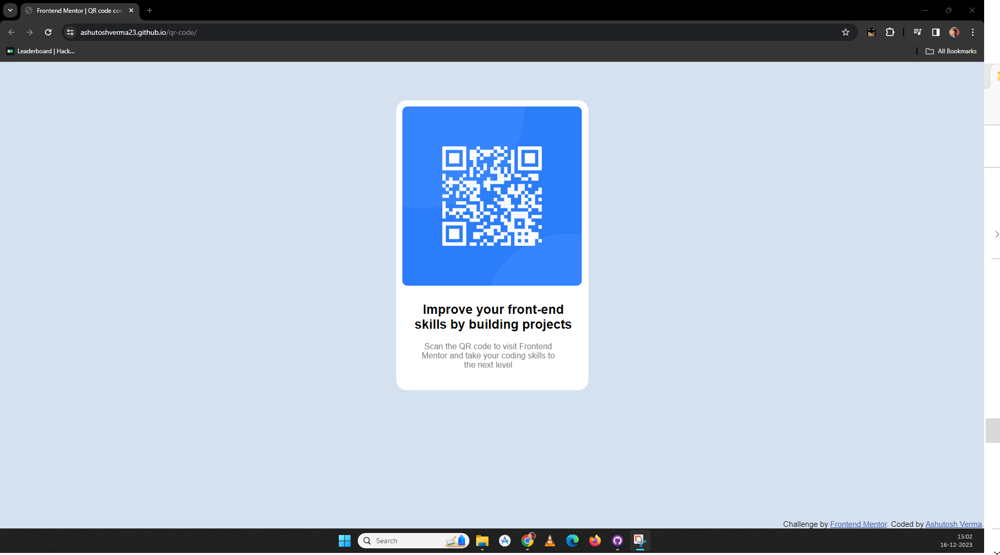

# Frontend Mentor - QR code component solution

This is a solution to the [QR code component challenge on Frontend Mentor](https://www.frontendmentor.io/challenges/qr-code-component-iux_sIO_H). Frontend Mentor challenges help you improve your coding skills by building realistic projects. 

## Table of contents

- [Overview](#overview)
  - [Screenshot](#screenshot)
  - [Links](#links)
- [My process](#my-process)
  - [Built with](#built-with)
  - [What I learned](#what-i-learned)
  - [Useful resources](#useful-resources)

## Overview

### Screenshot



### Links

- Solution URL:  [Solution URL](https://github.com/ashutoshverma23/qr-code)
- Live Site URL: [Live Site URL](https://ashutoshverma23.github.io/qr-code/)

## My process

### Built with

- Semantic HTML5 markup
- CSS custom properties
- Flexbox
- CSS Grid

### What I learned

```css
These three css property for flex are very useful
.container{
justify-content: center;
    align-content: center;
    flex-direction: column;
}
```

### Useful resources

Had a huge help for learning CSS components by Code with Harry (https://www.youtube.com/watch?v=5qVuORLniwM&t=350s)

